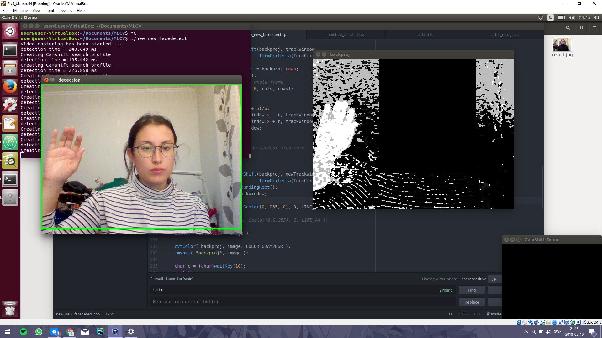
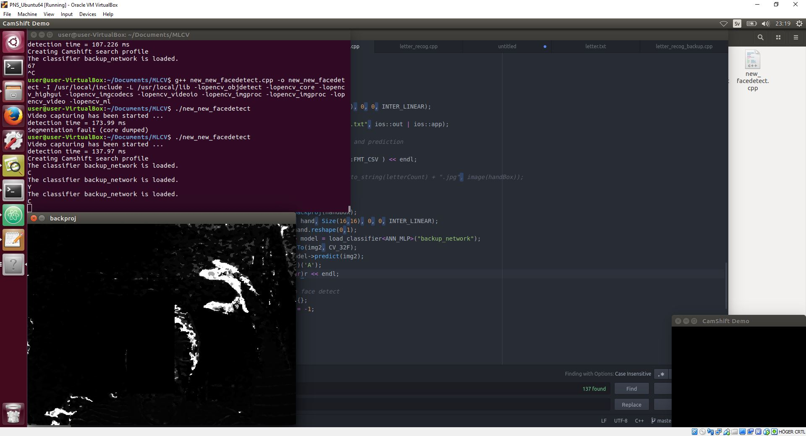
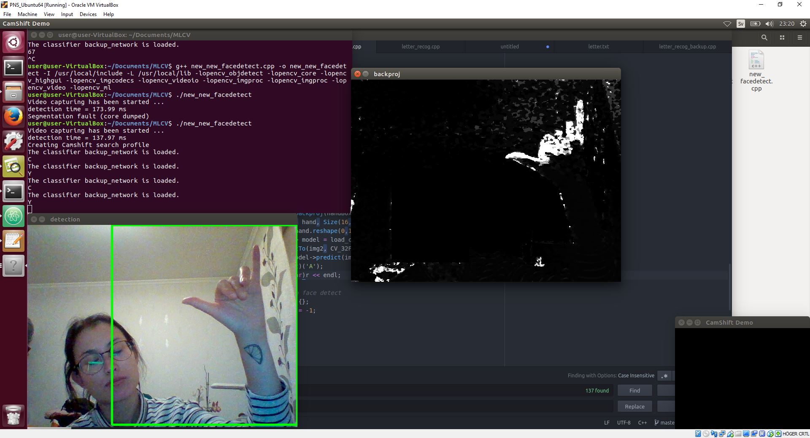

# Machine Learning for Computer Vision Lab

## Description
Use face detection, camshift and machine learning models, all from the OpenCV library, to detect sign language letters.

## Contents
- **facedetect_new.cpp** - main code (face detection + camshift merge)
- **letter_recog_new.cpp** - modified letter recognition program to train hand data
- **letter.txt** - the hand data used to train the model. It has around 30 samples of the letter "C" and "Y" each
- **backup_network** - the resulting trained model
- ***Letter_C_example.jpg*** - example picture of what my hand looked like during training
- ***result_from_detectAndDraw.jpg*** - the face detected in the first face detection stage when the code is running

### Compilation commands
May vary depending on library location.
```
g++ facedetect_new.cpp -o facedetect_new -I /usr/local/include -L /usr/local/lib -lopencv_objdetect -lopencv_core -lopencv_highgui -lopencv_imgcodecs -lopencv_videoio -lopencv_imgproc -lopencv_imgproc -lopencv_video -lopencv_ml
```
```
g++ letter_recog_new.cpp -o letter_recog_new -I/usr/local/include -L/usr/local/lib -lopencv_core -lopencv_ml
```
## Instructions
### Predict sign using the existing model
Note: This probably wont work since the lighting and our skin tones are different.
1. Start ```./facedetect_new ```
2. When you can see yourself, make a "C" or a "Y" with your hand (next to your face, not in front of) 
3. and press "p" when the rectangle is around your hand. The predicted letter will be written in the command line.

### Re-training the model and predict
1. Change line 162 in facedetect_new.cpp to the letter you want to make.
2. Recompile facedetect_new.cpp
3. Start ```./facedetect_new ```
4. When you can see yourself, make your sign letter of choice
5. When the rectangle is around your hand, press "x"
6. Press "x" several times. I did 30.
7. Do step 1-6 again, with another letter.
8. Open **letter.txt** and remove all the spaces. Easily done with a text editor. Find ",  "(comma, spaces) and replace with "," (comma).
9. Run ```./letter_recog_new ``` once to generate the model file.
10.  Start ```./facedetect_new ```
11. When you can see yourself, make your sign.
12. Press "p" when the rectangle is around your hand. The predicted letter will be written in the command line.

## Result
One thing first worth mentioning is that it was really hard to detect my hand in my house. In the classroom, the lighting seemes just perfect, because I didn't have any problems there. When I came home and ran it, it often wanted to detect the whole screen as a hand:



But after experimenting with the light in the room, I got some results. The program successfully managed to detect my sign language "C" and "Y".



